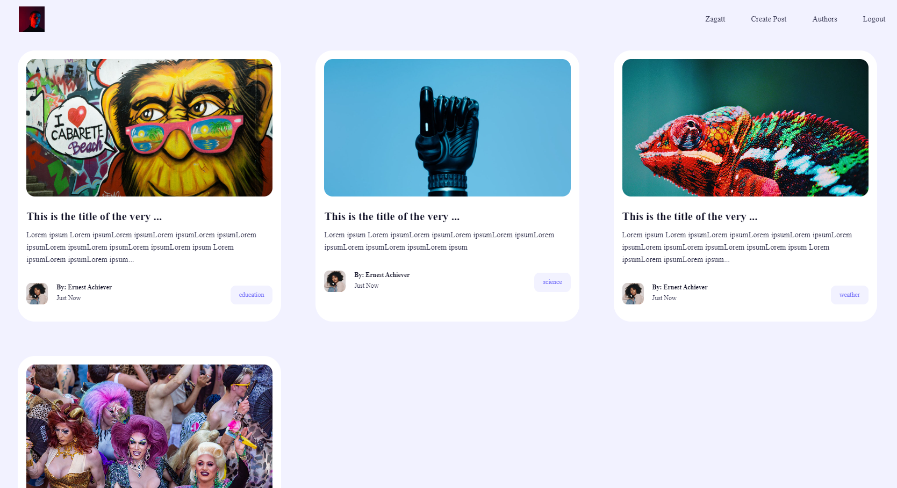

# Challenge Process – 2024 

#Tech & Product Team

> The objective of this challenge is to model and implement a simple Blog, using ReactJs, Node.Js and MongoDB.

### Settings and improvements

The project is still in development and the next updates will be handled in the next tasks:

- [ ] Tarefa 1 - Create unit tests;
- [ ] Tarefa 2 - Finalize the server side;
- [ ] Tarefa 3 - Apply Mask to inputs;
- [ ] Tarefa 4 - Finalize responsiveness;
- [ ] Tarefa 5 - Create new filters to search for posts;
- [ ] Tarefa 6 - Render the error messages coming from the database;

## 💻 Pre-requisites

Before you begin, make sure you have met the following requirements:
* You have installed the latest version of the browser you use.
* You've got a machine `<Windows / Linux / Mac>`.
* You have install `<VSCode>`.

## 🤝 Colaborators

People who have contributed to this project:

<table>
  <tr>
    <td align="center">
      <a href="https://github.com/LZagatto" target="_blank">
         
        
          <b>Leonardo Zagatto</b>
        
      </a>
    </td>
  </tr>
</table>

## 😄 Seja um dos contribuidores

Quer fazer parte desse projeto? Clique [AQUI](mailto:leozagatto1@gmail.com) e me envie um email.

[⬆ Voltar ao topo](#Finder-React) 
